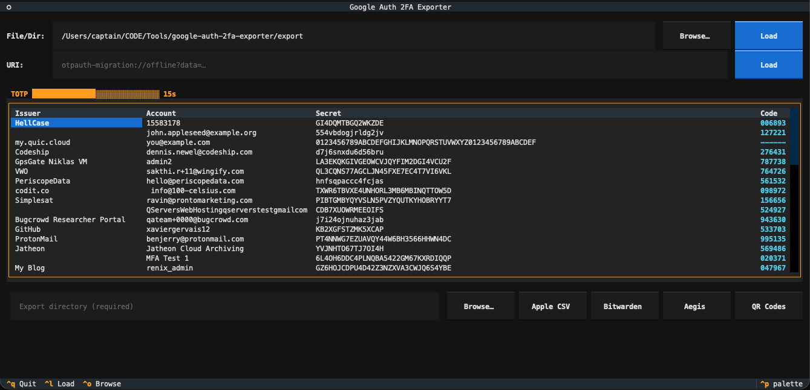

# Google Auth 2FA Exporter

A terminal UI (TUI) application that decodes Google Authenticator export QR codes and lets you view live TOTP codes, then export your secrets to multiple formats.



## Features

- **Scan QR code images** — load a single image file or point to a directory to scan all images in it automatically
- **Paste URIs directly** — supports Google Authenticator bulk export URIs (`otpauth-migration://`) as well as standard single-account URIs (`otpauth://totp/` and `otpauth://hotp/`)
- **Built-in file browser** — modal tree browser for selecting images, directories, and export folders
- **Live TOTP codes** — decoded accounts displayed in a table with codes that update every second alongside a visual countdown timer
- **Click to copy** — click any table cell (issuer, account, secret, or code) to copy its value to the system clipboard
- **Export to multiple formats:**
  - **Apple Passwords CSV** — for import into the macOS Passwords app
  - **Bitwarden CSV** — for import into Bitwarden
  - **Aegis JSON** — for import into Aegis Authenticator
  - **Individual QR code PNGs** — one scannable QR code per account, importable by any authenticator app
- **Usable as a Python library** for programmatic access

## Supported Image Formats

PNG, JPEG, BMP, GIF, WebP, and TIFF.

## Requirements

- Python 3.12
- [uv](https://github.com/astral-sh/uv) package manager

## Installation

```bash
git clone https://github.com/CaptainCodeAU/google_auth_2fa_exporter.git
cd google_auth_2fa_exporter
uv sync
```

## Usage

### Launch the TUI

```bash
uv run google-auth-2fa-exporter
```

Or run directly:

```bash
uv run python main.py
```

### TUI Workflow

1. **Load accounts** using one of two methods:
   - **File/Dir** — enter the path to a single QR code image, or a directory containing multiple QR code images (all supported images in the directory will be scanned automatically). You can type the path directly or click **Browse** to open a file/directory picker. Then click **Load**.
   - **URI** — paste a URI into the text field and click **Load**. Accepted formats:
     - `otpauth-migration://offline?data=...` (Google Authenticator bulk export)
     - `otpauth://totp/...` (standard single-account TOTP)
     - `otpauth://hotp/...` (standard single-account HOTP)
2. **View accounts** — the table shows Issuer, Account, Secret, and a live Code column. Codes refresh every second. The TOTP countdown timer bar shows how many seconds remain in the current 30-second window.
3. **Copy values** — click any cell in the table to copy its value to the system clipboard. A toast notification confirms the copy.
4. **Export** — enter an output directory (or click **Browse** to select one), then click one of the export buttons:
   - **Apple CSV** — produces `apple_passwords_export.csv`
   - **Bitwarden** — produces `bitwarden_export.csv`
   - **Aegis** — produces `aegis_export.json`
   - **QR Codes** — produces one `Issuer (Account).png` file per account
5. **Quit** — press `Ctrl+Q` or close the terminal

### Keyboard Shortcuts

| Key      | Action                    |
| -------- | ------------------------- |
| `Ctrl+L` | Load accounts             |
| `Ctrl+O` | Browse for file/directory |
| `Ctrl+Q` | Quit                      |

### CLI Flags

```bash
uv run google-auth-2fa-exporter --version
uv run google-auth-2fa-exporter --help
```

### Use as a Library

```python
from google_auth_2fa_exporter import decode_uri, extract_accounts

# From a Google Authenticator bulk export URI
accounts = decode_uri("otpauth-migration://offline?data=...")

# From a standard otpauth URI
accounts = decode_uri("otpauth://totp/GitHub:user@example.com?secret=JBSWY3DPEHPK3PXP&issuer=GitHub")

# From a single QR code image
from pathlib import Path
accounts = extract_accounts(Path("export_qr.png"))

# From a directory of QR code images
accounts = extract_accounts(Path("./qr_images/"))

for acct in accounts:
    print(f"{acct.issuer}: {acct.name} — secret: {acct.totp_secret}")
```

## Development

```bash
# Install with dev dependencies
uv sync --group dev

# Run tests
uv run pytest

# Lint
uv run ruff check src/ tests/

# Format
uv run ruff format src/ tests/
```

### Regenerating Protobuf Bindings

If you modify `google_auth.proto`:

```bash
uv run python -m grpc_tools.protoc -I. --python_out=. --mypy_out=. google_auth.proto
cp google_auth_pb2.py google_auth_pb2.pyi src/google_auth_2fa_exporter/
```

## License

MIT
